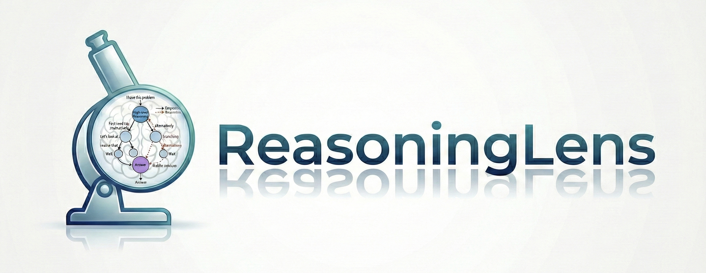
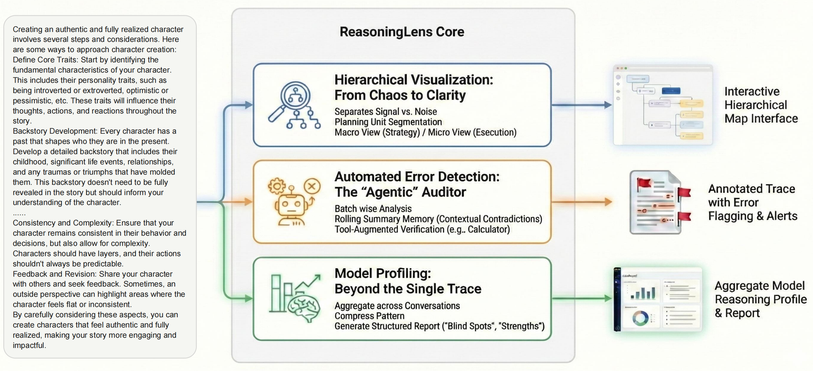
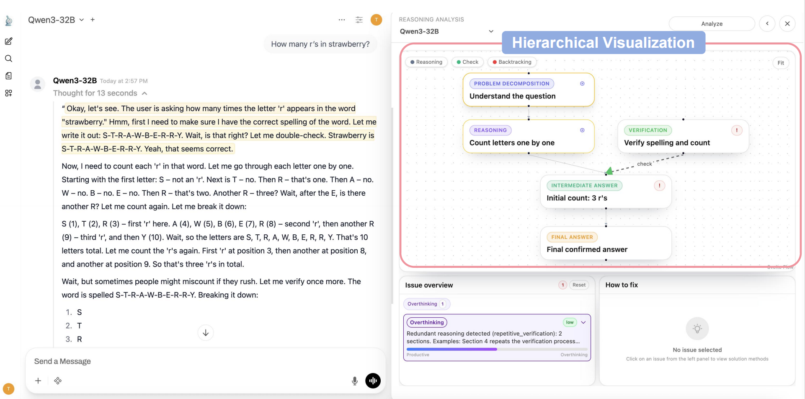
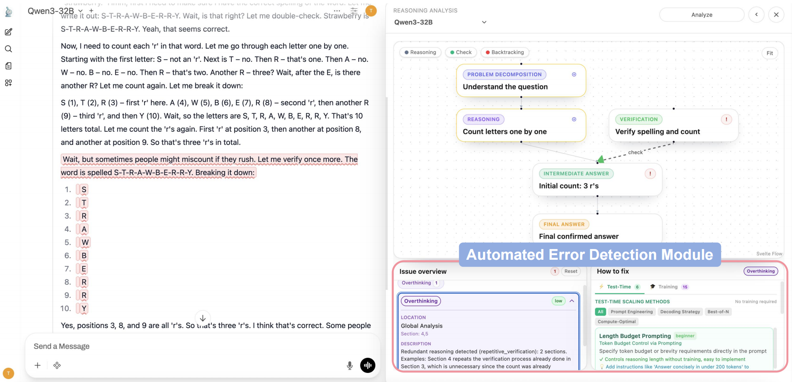
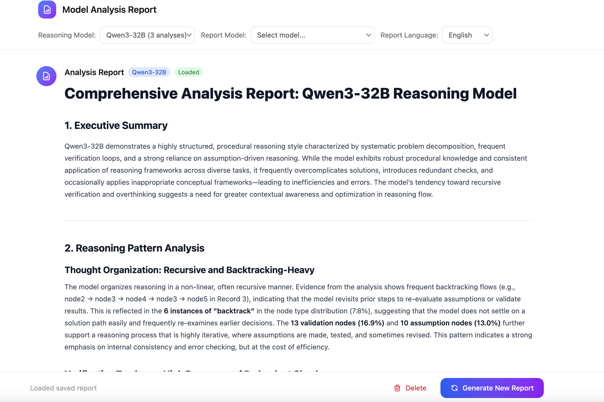

# 🔍 ReasoningLens

<div align="center">

### **Escape the "CoT Maze": Unmasking Model Reasoning at a Glance**



[](LICENSE)
[](https://www.python.org/)
[](https://nodejs.org/)

[**English**](#-reasoninglens) | [**🇨🇳 中文文档**](README_CN.md)

</div>

---

> **TL;DR:** Long-form reasoning (CoT) is a double-edged sword. While models like OpenAI o1 and DeepSeek-R1 are smarter than ever, debugging a 10,000-token reasoning trace is a nightmare. **ReasoningLens** turns that "Wall of Text" into an interactive, hierarchical map.

https://github.com/user-attachments/assets/5ed8c14e-cc73-4b1c-8622-3c19cd7b9450

## 🤯 The Problem: When Transparency Becomes a Burden

The era of **Large Reasoning Models (LRMs)** has arrived. We love their ability to self-correct and plan, but there's a catch: **Understanding *how* they reached a conclusion is getting harder.**

When a model produces a massive reasoning trace, the "critical" logic often gets buried under repetitive procedural steps. Finding a single hallucination or a logical pivot feels like finding a needle in a haystack.


## 💡 Introducing ReasoningLens

Built on top of **[Open WebUI](https://github.com/open-webui/open-webui.git)**, ReasoningLens is a developer-centric toolkit designed to help the open-source community **visualize, understand, and debug** modern reasoning chains without losing their minds.

> **"ReasoningLens doesn't just show you what the model said; it shows you *how* the model thinks."**

<div align="center">

</div>


## ✨ Key Features

### 🗺️ Hierarchical Visualization: From Chaos to Clarity

Most CoT tokens are just "execution" (doing the math), while only a few are "strategic" (deciding to change course). ReasoningLens separates the signal from the noise:

- **Planning Unit Segmentation:** We automatically detect logical words like *"Wait, let me re-check..."* or *"Alternatively..."*.
- **The Macro View (Exploration):** See the high-level strategy—where the model backtracked, where it validated, and where it struggled.
- **The Micro View (Exploitation):** Dive deep into specific arithmetic or substitutions only when you need to.

<div align="center">

</div>

### 🕵️ Automated Error Detection: The "Agentic" Auditor

Longer reasoning doesn't always mean better reasoning. "Length-scaling" can introduce hallucinations that are hard to spot. Our **SectionAnalysisAgent** acts as a specialized auditor for your traces:

- **⚡ Batch-wise Analysis:** Efficiently parses massive traces without losing context, making large-scale debugging feasible.
- **🧠 Rolling Summary Memory:** Remembers context from prior sections, catching non-local inconsistencies and logical drift that would exhaust a human reviewer.
- **🧮 Tool-Augmented Verification:** Tired of models failing at basic math? ReasoningLens integrates a calculator to verify arithmetic steps automatically.

<div align="center">

</div>


### 📊 Model Profiling: Beyond the Single Trace

One-off debugging is great, but **systemic patterns** matter more. ReasoningLens aggregates data across multiple conversations to build a **Reasoning Profile** of your model:

1. **Aggregate:** Collect traces across diverse domains (Coding, Math, Logic).
2. **Compress:** Distill recurring patterns into a compact memory state.
3. **Report:** Generate a structured Markdown report highlighting the model's "Blind Spots" and "Consistent Strengths."

<div align="center">

</div>


## 🚀 Getting Started

### Prerequisites

- **Python**: Version **3.11 or higher** (Required for backend services)
- **Node.js**: Version **22.10 or higher** (Required for frontend development)
- **Docker** & **Docker Compose** (For containerized deployment)


## 📦 Installation

### Option 1: Conda Environment (Development)

#### 1. Clone the Repository

```bash
git clone https://github.com/icip-cas/reasoning-lens.git
cd reasoning-lens
```

#### 2. Backend Setup

```bash
cd backend

# Create and activate conda environment
conda create --name open-webui python=3.11
conda activate open-webui

# Install dependencies
pip install -r requirements.txt -U

# Start backend server
sh dev.sh
```

The backend will be running at: `http://localhost:8080`

#### 3. Frontend Setup

Open a new terminal:

```bash
# Install frontend dependencies
npm install --force

# Start development server
npm run dev
```

The frontend will be running at: `http://localhost:5173`


### Option 2: Docker Compose (Recommended)

#### Quick Start

```bash
# Make the script executable
chmod +x dev-docker.sh

# Start development environment
./dev-docker.sh
```

This will automatically:

- Clean up old containers
- Create necessary data volumes
- Start both frontend and backend services

**Access URLs:**

- 🌐 Frontend: `http://localhost:5173`
- 🔧 Backend: `http://localhost:8080`

#### Docker Commands

```bash
# View all logs
docker-compose -f docker-compose.dev.yaml logs -f

# View backend logs only
docker-compose -f docker-compose.dev.yaml logs -f backend

# View frontend logs only
docker-compose -f docker-compose.dev.yaml logs -f frontend

# Stop all services
docker-compose -f docker-compose.dev.yaml down

# Restart backend
docker-compose -f docker-compose.dev.yaml restart backend

# Restart frontend
docker-compose -f docker-compose.dev.yaml restart frontend
```


### Option 3: Docker Build (Production)

#### Build the Docker Image

```bash
# Basic build (CPU only)
docker build -t reasoning-lens:latest .

# Build with CUDA support
docker build --build-arg USE_CUDA=true -t reasoning-lens:cuda .

# Build with Ollama integration
docker build --build-arg USE_OLLAMA=true -t reasoning-lens:ollama .

# Build slim version (without pre-downloaded models)
docker build --build-arg USE_SLIM=true -t reasoning-lens:slim .
```

#### Build Arguments

| Argument              | Default                                  | Description                                    |
| --------------------- | ---------------------------------------- | ---------------------------------------------- |
| `USE_CUDA`            | `false`                                  | Enable CUDA/GPU support                        |
| `USE_CUDA_VER`        | `cu128`                                  | CUDA version (e.g., `cu117`, `cu121`, `cu128`) |
| `USE_OLLAMA`          | `false`                                  | Include Ollama in the image                    |
| `USE_SLIM`            | `false`                                  | Skip pre-downloading embedding models          |
| `USE_EMBEDDING_MODEL` | `sentence-transformers/all-MiniLM-L6-v2` | Sentence transformer model for RAG             |
| `USE_RERANKING_MODEL` | `""`                                     | Reranking model for RAG                        |

#### Run the Container

```bash
# Run the container
docker run -d \
  --name reasoning-lens \
  -p 8080:8080 \
  -v reasoning-lens-data:/app/backend/data \
  reasoning-lens:latest

# Run with GPU support
docker run -d \
  --name reasoning-lens \
  --gpus all \
  -p 8080:8080 \
  -v reasoning-lens-data:/app/backend/data \
  reasoning-lens:cuda
```

#### Environment Variables

| Variable              | Description                                    |
| --------------------- | ---------------------------------------------- |
| `OPENAI_API_KEY`      | Your OpenAI API key                            |
| `OPENAI_API_BASE_URL` | Custom OpenAI-compatible API endpoint          |
| `WEBUI_SECRET_KEY`    | Secret key for session management              |
| `DEFAULT_USER_ROLE`   | Default role for new users (`user` or `admin`) |


## 🛠️ Development

### Project Structure

```
reasoning-lens/
├── backend/                 # Python backend (FastAPI)
│   ├── open_webui/          # Main application
│   │   ├── routers/         # API routes
│   │   ├── models/          # Data models
│   │   └── utils/           # Utilities
│   └── requirements.txt     # Python dependencies
├── src/                     # Svelte frontend
│   ├── lib/                 # Shared components
│   └── routes/              # Page routes
├── static/                  # Static assets
├── Dockerfile               # Production Docker build
├── docker-compose.dev.yaml  # Development compose file
└── docker-compose.yaml      # Production compose file
```

### Tech Stack

- **Backend**: Python 3.11+, FastAPI, SQLAlchemy
- **Frontend**: Svelte 5, TypeScript, TailwindCSS
- **Database**: SQLite (default), PostgreSQL (optional)
- **Containerization**: Docker, Docker Compose


## 📄 License

This project is licensed under the MIT License - see the [LICENSE](LICENSE) file for details.


## 📚 Citation

If you find ReasoningLens useful in your research, please consider citing:

```bibtex
@software{Zhang_ReasoningLens_2026,
  author = {Zhang, Jun and Zheng, Jiasheng and Lu, Yaojie and Cao, Boxi},
  license = {MIT},
  month = feb,
  title = {{ReasoningLens}},
  url = {https://github.com/icip-cas/ReasoningLens},
  version = {0.1.0},
  year = {2026}
}
```


## 👥 Team & Contributions

- **Jun Zhang** - Main Contributor
- **Jiasheng Zheng** - Contributor
- **Yaojie Lu** - Contributor
- **Boxi Cao** - Project Lead

## Acknowledgements
We thank the **[Open WebUI](https://github.com/open-webui/open-webui.git)** community and all early users and contributors for their feedback and support. We look forward to continued contributions from the open-source community. ReasoningLens is better because of your time and curiosity.

## 💬 Join Us

Have questions or want to discuss ideas? Open an issue on GitHub or join the discussion in our community! Together, let's create an even more powerful tool for the community. 🌟
